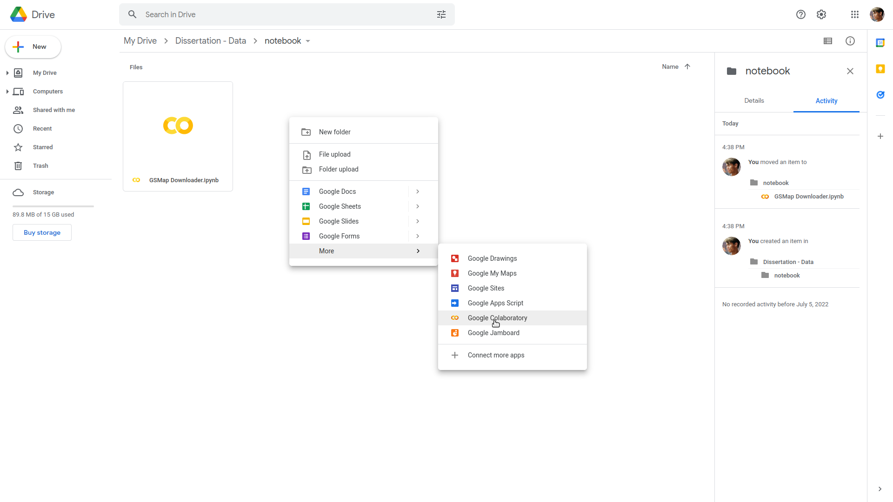

# **Pendahuluan**

**Python** adalah bahasa pemrograman interpretatif multiguna yang digunakan untuk membersihkan data, membuat visualisasi, dan membangun model oleh para *data scientist* saat ini. Python dikenal sebagai bahasa pemrograman yang mudah dipelajari, karena struktur sintaknya rapi dan mudah dipahami.

**Google Colab** merupakan salah satu produk dari Google yang dapat menunjang seluruh keperluan *data science* dan *machine learning* perusahaan di mana penggunanya dapat menjalankan kode **Python** tanpa perlu melakukan proses instalasi dan setup lainnya. Semua keperluan *setting* dan *adjustment* akan diserahkan ke *cloud*.

**Markdown** adalah sebuah tools untuk melakukan konversi text-to-HTML yang bisa digunakan ketika membuat konten web. Dengan menggunakan Markdown kita dapat menulis konten HTML dengan format yang mudah dibaca dan mudah pula untuk ditulis (easy-to-read dan easy-to write). Kelebihan menggunakan Markdown adalah format penulisannya yang sangat manusiawi sehingga sangat mudah sekali untuk dibaca dan ditulis. Dengannya pula kita tidak perlu lagi dipusingkan dengan styling ketika menulis konten dan bisa fokus pada konten.

# **Penggunaan**

- Untuk menggunakan Google Colab kita harus memiliki akun Google lalu kemudian akses fitur Colaboratory. 

- Jika tidak memiliki akun Google, sebagian besar dari fitur Colaboratory yang perlu kita akses tidak akan berfungsi.

- Karena Google Colaboratory bekerja dalam Google Drive, kita harus menentukan folder yang akan digunakan. 

**Mengakses Google Colab Secara Langsung**

Google Colab dapat diakses dengan alamat situs web https://colab.research.google.com/

Setelah mengunjungi situs web tersebut akan muncul *popup*, kemudian pilih "New notebook" untuk membuat sebuah *file* baru seperti gambar di bawah

Notebook baru berhasil dibuat

**Mengakses Google Colab melalui Google Drive**

- Mengakses Google Drive dengan alamat https://drive.google.com/
- Membuat Folder Baru

Kita harus membuat file Notebook baru terlebih dahulu dengan cara klik kanan di dalam folder yang baru saja kita buat, pilih More dan lalu klik opsi Colaboratory.

Notebook baru berhasil dibuat

# **Dokumentasi Mendalam**

- [Python](https://www.python.org/doc/)
- [Google Colab](https://colab.research.google.com/)
- [Markdown](https://www.markdownguide.org/basic-syntax/)

# **Referensi**

- [Mengenal Google Colab: Mulai dari Definisi, Cara Menggunakan, hingga Manfaatnya](https://glints.com/id/lowongan/google-colab-adalah/)
- [Google Colab - What is Google Colab?](https://www.tutorialspoint.com/google_colab/what_is_google_colab.htm)
- [APA ITU PYTHON?](https://algorit.ma/blog/belajar-apa-itu-python/)
- [Belajar Pemrograman Python: Pengenalan Dasar Python dan Persiapan Awal](https://www.petanikode.com/python-linux/)
- [Kenalan Dengan Markdown](https://www.codepolitan.com/kenalan-dengan-markdown/)

